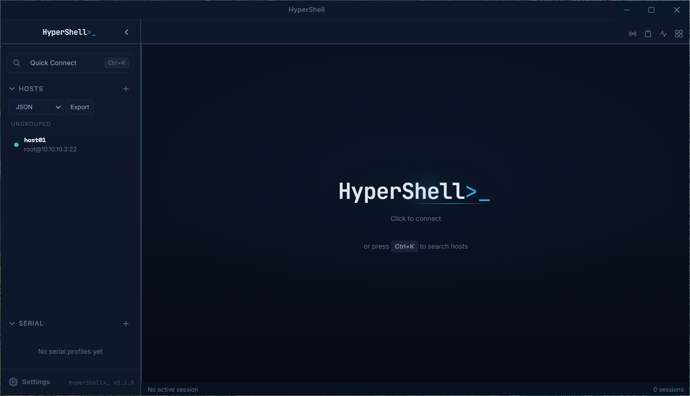
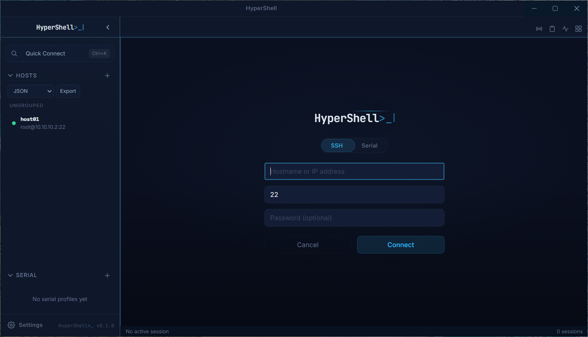
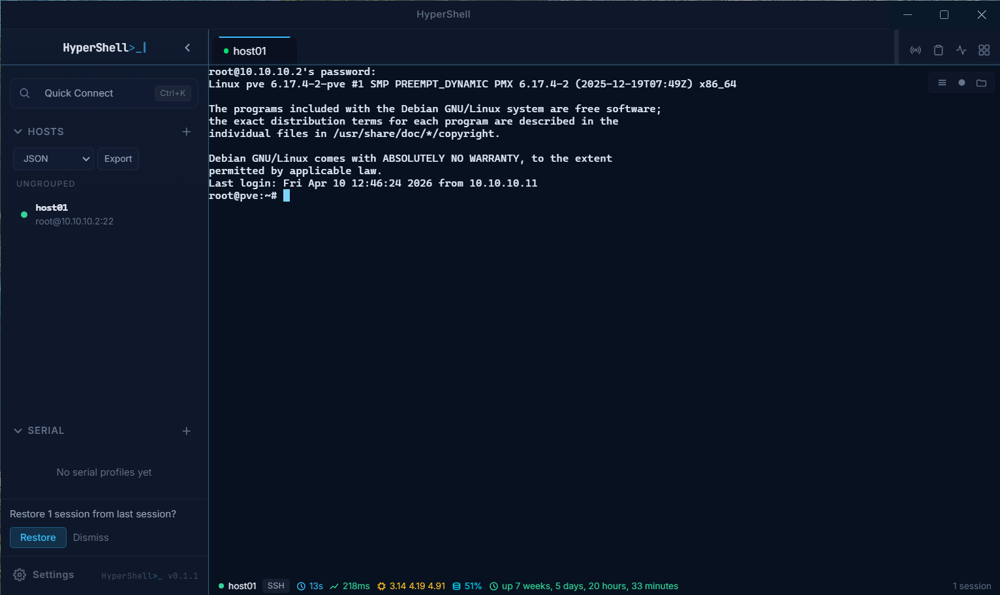
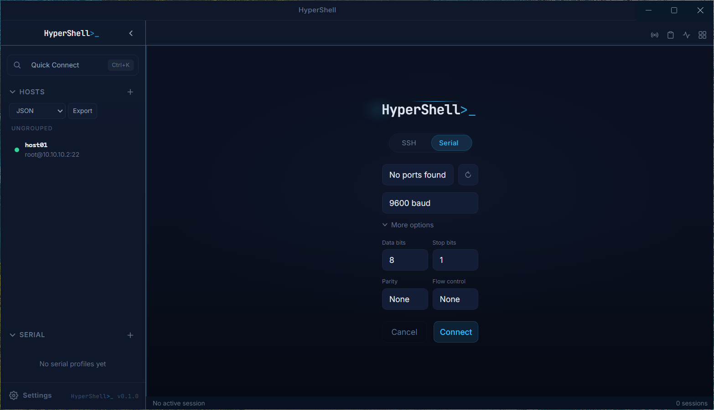

<p align="center">
  <picture>
    <source media="(prefers-color-scheme: dark)" srcset="assets/logo.svg">
    <source media="(prefers-color-scheme: light)" srcset="assets/logo-light.svg">
    
  </picture>
</p>

<p align="center">
  A desktop SSH and serial terminal with an integrated SFTP file browser.<br>
  Built with Electron, React, and xterm.js.
</p>


---

<p align="center">
  
  
</p>
<p align="center">
  
  
</p>

---

## Features

**Terminal**
- SSH connections via system `ssh` binary (full agent/config/proxy support)
- Serial port terminal with configurable baud, parity, and flow control
- Tabs, split panes, and broadcast mode (send to multiple sessions)
- Terminal search, session logging, and keyboard shortcuts

**SFTP File Browser**
- Dual-pane commander-style file browser with transfer queue
- Remote file editing in a dedicated CodeMirror editor window
- Bookmarks, sync engine, and recursive folder transfers
- Keyboard navigation with vim-style and F-key bindings

**Host Management**
- Host CRUD with groups, color tags, and drag-and-drop reorder
- SSH config import from `~/.ssh/config`
- PuTTY session import from Windows registry
- 1Password credential references
- Per-host jump host (ProxyJump), keep-alive, and auto-reconnect settings

**Port Forwarding**
- Standalone and host-linked local/remote/dynamic tunnels
- Visual Tunnel Manager with topology diagram

**Networking**
- SSH2 connection pool with ref counting and idle timeout
- Network-aware auto-reconnect with DNS probing
- Host key verification for SFTP connections
- Keyboard-interactive authentication (2FA)

**Extras**
- Snippets manager with send-to-terminal
- Session recovery and workspace save/restore
- Database backup and restore with auto-backup on startup
- System tray integration
- Host status monitoring

## Quick Start

### Prerequisites

- [Node.js](https://nodejs.org/) 22+
- [pnpm](https://pnpm.io/) 10.8+
- Windows: Visual Studio Build Tools (for native modules)
- macOS: Xcode Command Line Tools

### Install and Run

```bash
git clone https://github.com/tomertec/HyperShell.git
cd hypershell
pnpm install
pnpm build
pnpm --filter @hypershell/desktop dev
```

The app opens an Electron window. The renderer runs on Vite HMR (port 5173) during development.

## Architecture

```
+--------------------------------------------------+
|                   Electron Shell                  |
|                                                   |
|  +--------------------+  +---------------------+ |
|  |   Main Process     |  |    Renderer (React)  | |
|  |                    |  |                      | |
|  |  SessionManager    |  |  Zustand Stores      | |
|  |   SSH PTY ---------|--|-> TerminalPane       | |
|  |   Serial    -------|--|-> TerminalPane       | |
|  |   SFTP      -------|--|-> SftpDualPane       | |
|  |                    |  |                      | |
|  |  SQLite DB         |  |  TabBar / Panes     | |
|  |  Host Monitor      |  |  Quick Connect      | |
|  |  Tray Integration  |  |  Settings Panel     | |
|  +--------+-----------+  +----------+----------+ |
|           |       Preload (Zod IPC)  |            |
|           +-------<window.hypershell>+            |
+--------------------------------------------------+
```

Three-layer Electron model with Zod-validated IPC at the preload boundary. Five pnpm workspaces:

| Workspace | Package | Role |
|-----------|---------|------|
| `apps/desktop` | `@hypershell/desktop` | Electron main process, preload bridge, IPC handlers |
| `apps/ui` | `@hypershell/ui` | React renderer — terminals, SFTP, host browser, settings |
| `packages/shared` | `@hypershell/shared` | IPC channel names and Zod request/response schemas |
| `packages/session-core` | `@hypershell/session-core` | Transport abstraction (SSH, serial, SFTP), connection pool |
| `packages/db` | `@hypershell/db` | SQLite database, migrations, repositories |

## Build Commands

```bash
pnpm build                    # Build all workspaces
pnpm test                     # Run all Vitest unit tests
pnpm lint                     # Lint all workspaces

# E2E tests (Playwright)
pnpm --filter @hypershell/ui test:e2e

# Windows installer
pnpm release:windows:unsigned

# macOS DMG
pnpm release:mac:unsigned
```

## Tech Stack

| Component | Technology | Version |
|-----------|-----------|---------|
| Desktop framework | Electron | 34.0.0 |
| UI framework | React | 19.1.0 |
| Terminal emulator | xterm.js | 6.0.0 |
| Language | TypeScript (strict) | 5.8.3 |
| SSH/SFTP client | ssh2 | 1.17.0 |
| Serial I/O | serialport | 12.0.0 |
| Database | SQLite (better-sqlite3) | 11.8.0 |
| State management | Zustand | 5.0.8 |
| Schema validation | Zod | 3.24.1 |
| Styling | Tailwind CSS | 4.2.2 |
| Code editor | CodeMirror | 6.0.2 |
| Bundler (UI) | Vite | 6.3.5 |
| Bundler (main) | esbuild | 0.25.12 |
| Unit tests | Vitest | 3.1.2 |
| E2E tests | Playwright | 1.54.1 |
| Packaging | electron-builder | 26.0.12 |

## Documentation

Full developer documentation is in the [`docs/`](docs/INDEX.md) directory, covering architecture, IPC reference, data model, configuration, testing, build and release, and troubleshooting.

## License

MIT
